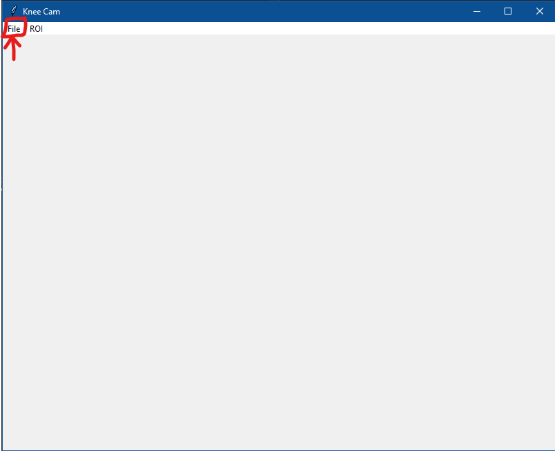
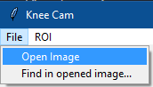
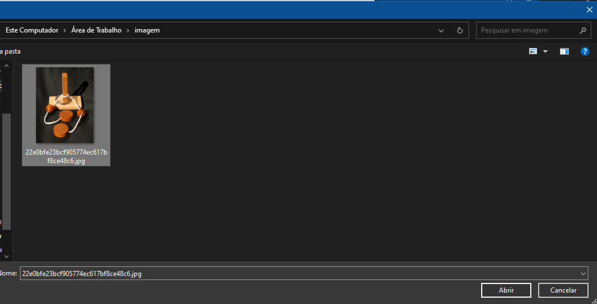
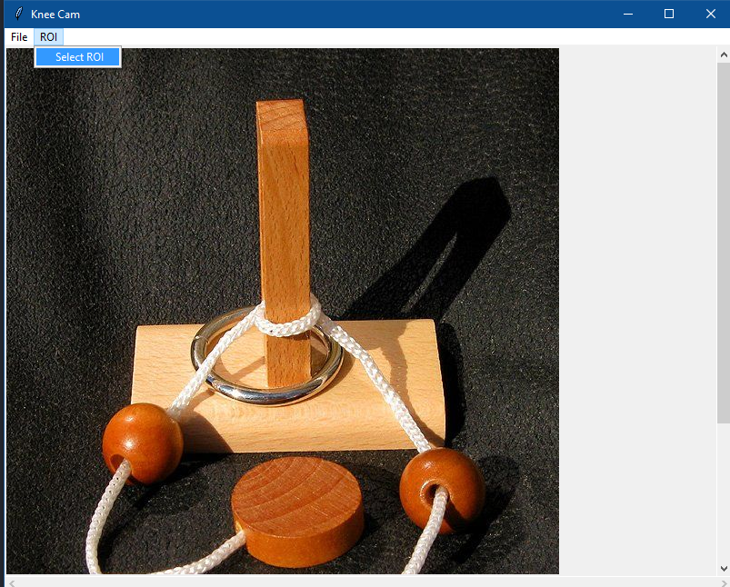
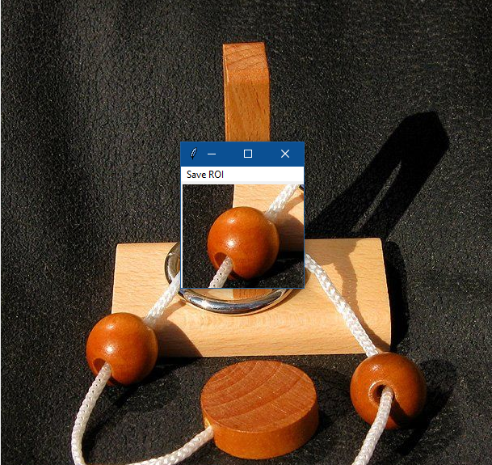
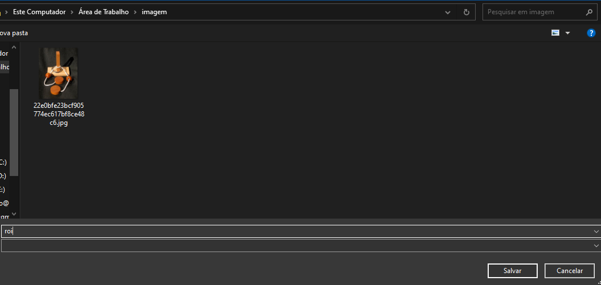
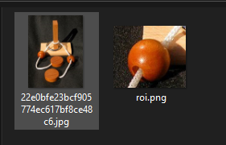
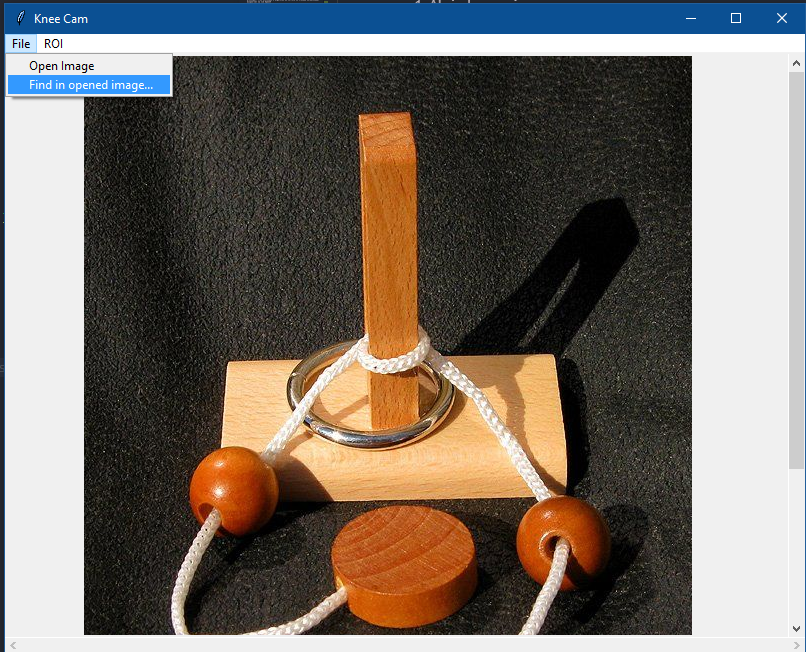
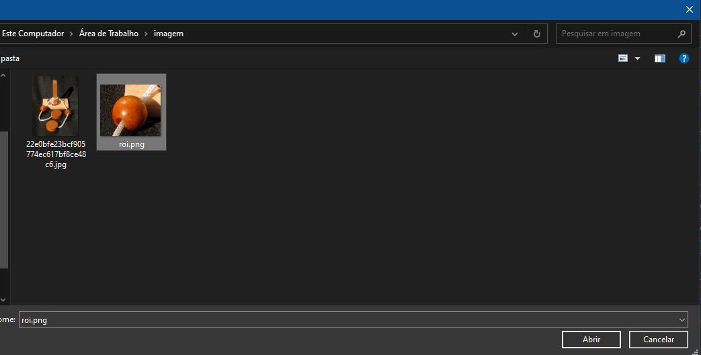
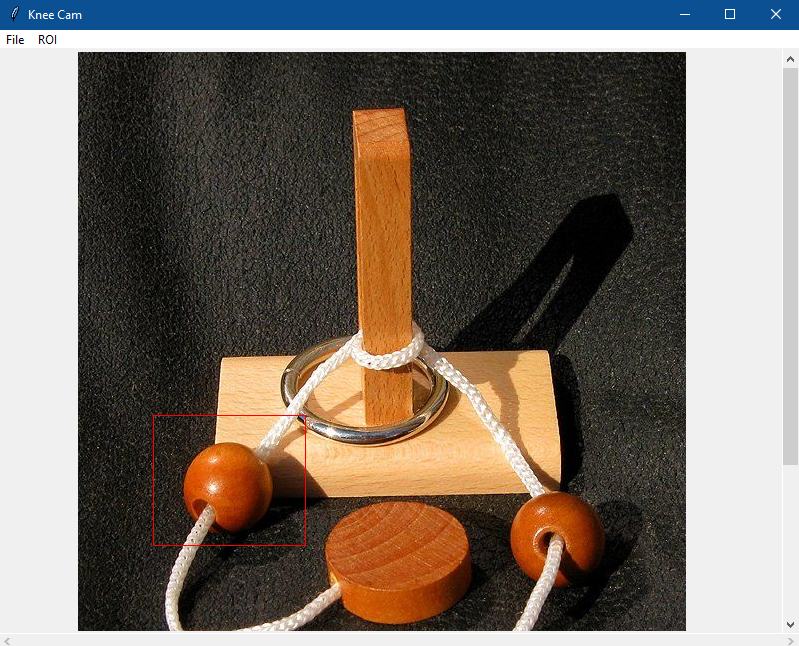

# knee-cam

Projeto para a disciplina de Processamento de Imagem

# Integrantes

Nome | Matrícula | Curso | Campus

Hugo Brandão de Oliveira | 640727 | Engenharia de Computação | Coração Eucarístico

Gabriell Murta de Paula Nunes | 636042 | Engenharia de Computação | Coração Eucarístico

Joao Antônio Ferreira Neto | 640846 | Engenharia de Computação | Coração Eucarístico

# Instalação

Versão Python: 3.8.10 (Sugestão: utilizar pyenv para instalação)

Instalar e utilizar o pacote pipenv para instalação dos pacotes

- pip install pipenv

Caso linux:

- Instalar o pacote python3-tk pelo apt (ou gerenciador de pacotes da versão utilizada)
- Isso permite que o tkinter seja utilizado (por algum motivo não é possível instalá-lo pelo pipfile)

Para realizar a instalação dos pacotes, rodar o comando:

- python -m pipenv install

Após isso, para executar o programa, rodar os comandos (considerando que o diretório corrente seja o diretório principal do projeto, diretório que contém a pasta src):

- python -m pipenv shell (habilita o ambiente virtual criado pelo pipenv)
- python ./src/main.py

# Libs utilizadas

Tkinter - Biblioteca de GUI nativa do Python, com exibições nativas para cada sistema.
OpenCV - Para uso do algoritmo de correlação cruzada.
PIL - Manipulação de arquivos de imagem.
numpy - Manipulação de arrays (conversão de imagens do PIL em imagens do OpenCV).

# Execução

Para abrir uma imagem, basta ir no menu File -> Open Image. Um diálogo será aberto aguardando a seleção de um arquivo de imagem.
Ao abrir a imagem, é possível selecionar uma região de interesse através do menu ROI -> Select ROI
Isso permite ao usuário selecionar um retângulo na imagem.
Ao selecionar o retângulo, será exibido em outra janela a região selecionada, na qual é possível selecionar a opção Save ROI, onde outro diálogo permite ao usuário salvar a seleção como PNG.

Para encontrar uma ROI previamente selecionada, basta ir no menu File -> Find inside opened image...
Assim, será exibida a ROI sobreposta como um retângulo sobre a imagem principal. (Foi utilizado o algoritmo de Correlação Cruzada Normalizada, disponível na lib OpenCV

# Tutorial em imagens

1. Abrindo uma imagem:
   
   
   

2. Selecionando uma ROI:
   

3. Ao selecionar a ROI, ela é exibida em uma janela separada:
   

4. Salvando a ROI:
   
   

5. Encontrando a ROI na imagem:
   
   

6. Resultado:
   

# Modelos CNNs
Os modelos prontos das CNNs estão no seguinte link:  
Por ser muito grande não foi possivel armazer no GIT o modelo.
